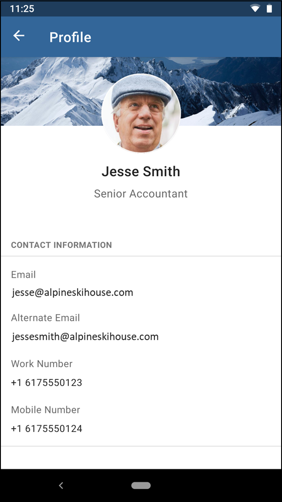

## TheForkChallenge

Neige just got out of school. He read a lot about clean architecture & android.  
He just created this POC based on this [dummy api](https://dummyapi.io/docs).  
To run this draft project you have to create your own app-id and change it in `UserService.kt`

He started to create 4 modules :

- A well known `:app` module
- Two features module `search` and `user`.
- The `api` module.

**But he needs your help to improve his skill**

#### Tips
- To help him, **you can add dependencies** you think he would need.
- You **should improve the architecture** where you think it's necessary.
- Each question is more complex than the previous one. Be sure to cover them correctly before going to the next one
- Don't hesitate to look at the FAQ section at the end of that file

### 1st - Architecture:

Can you give him feedback on the architecture of his project ?  
You should point out the good things and the issues you found (at least 3 of each).

**Good things :**
- Simplified app. POCs should be simple to get a concept out as soon as possible.
- The app has separation of features into modules that will be easy to start actual work on it.
- API module does not have any Android dependencies.

**Issues :**
- MVP architecture has no contracts and is only based on concrete classes.
- SearchPresenter is dependent on SearchActivity. There are a few issues here: 
  - A chance to leak context. We should NOT hold references to context (even though the presenter is only initialised in the Activity and it's life is closely tied to it)
  - Cannot be reused with other views. (Views should be separated with an interface to depend on abstractions not concretes - Dependency inversion principle)
- SearchPresenter has a hard dependency on CoroutineDispatchers and cannot be tested. They should be parameters to be able to inject testCoroutineDispatcher in unit tests.
- SearchPresenter has a hard dependency on Api class. User services should be injected into SearchPresenter constructor to allow mocking and testing.
- Non-null assertion is a high risk of NPE, especially when asserting BE responses that we can't guarantee are non-null (SearchPresenter, line:16 ...response.body()!!)

### 2nd - Unit tests:

He never did any test, and he’s stuck with his `SearchPresenter`.  
Help him improve that class so that it’s testable and write the tests for him.
NB : Do not migrate this SearchPresenter to any other pattern (MVVM, etc), just make it testable and test it 

### 3rd - New activity implementation:

Now, you must help him finish the app by 
- coding the `UserActivity.kt`
- plugging it to the `SearchActivity.kt` (you can use his navigation function`navigateToUser`).  

For this question you should use [Jetpack Compose](https://developer.android.com/jetpack/compose)
Also, don't hesitate to apply the advices you gave him in question #1

Here is a example of what it could look like

Don't forget to look at the [API](https://dummyapi.io/explorer)

### 4th - Navigation:

As you can see, `UserActivity.kt` is opened using reflection (especially the class name `com.thefork.challenge.user.UserActivity`). What are the drawbacks of that solution ?  
Neige would like to improve the navigation but he doesn't want to create a dependency between `search` & `user`.

Can you explain why ?
> The drawback to using reflection is that there is no guarantee that user module exists.
> The destination name or location could change and we could forget to update search module.
> The argument USER_ID could also change and it need to be updated in both modules.

Could you suggest a solution and even **implement** it ?
> In this particular scenario (without adding Navigation Component from Jetpack) the best solution would be to navigate with deeplink.
> This will also allow us to navigate to that module through other means: links, notifications, other features.

### Congrats !!

You just reached the end of the test.
Now it's time to zip it and send it back to your contact at TheFork !
We will schedule a technical interview to debrief it ASAP.

### FAQ

**I just downloaded the project, when is the deadline to send it back ?**
> There is no real deadline for the submission, however as we receive a lot of candidates, **a "one week" timing is preferred**.

**How much time should I spend on it ?**  
> Obviously, the average time spent on the project depend on the profile (junior/senior) and experience with code and libs (kotlin, coroutine, compose, unit testing)  
90% of candidates spend **between 4 and 8 hours**.

**Can I move from MVP to MVVM ? or should I stick to the current architecture ?**  
> This project is a sand box for you to complete the 4 questions.
We advise you to keep the search module as it is. On the other side, feel free to do whatever you want in the user module.
NB : in the end be sure that **your solution answers ALL the questions**.

**Can I create new modules or change module hierarchy ?**  
> Yes, but please keep the **search** and **user** separated to be able to answer question 4.

**The recycler view doesn't have pagination, should I do it ? Can I use Android Paging Library ?**  
> It's not mandatory within the 4 questions.  
However, if you have time, feel free to show us the pattern you like to implement for infinite scroll (with or without libraries)

**The API contains more information than visible in the UI should I fill the gap ?**  
> We consider this test as a way to challenge you on architecture and unit testing from API to UI.  
Mapping more fields, making UI animations, ... won't be our focus points.

**Can I explain my decisions in this Readme file ?**
> Of course ! We even encourage you to do it :)